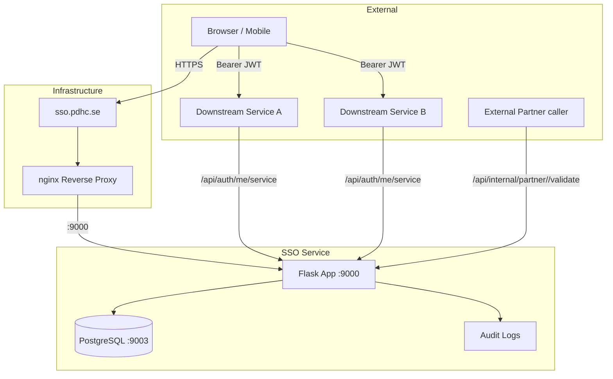
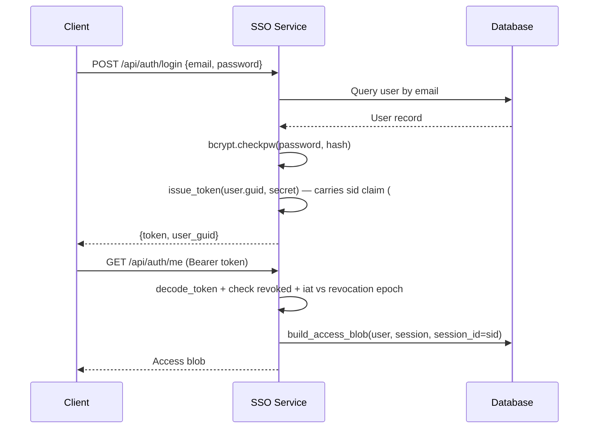
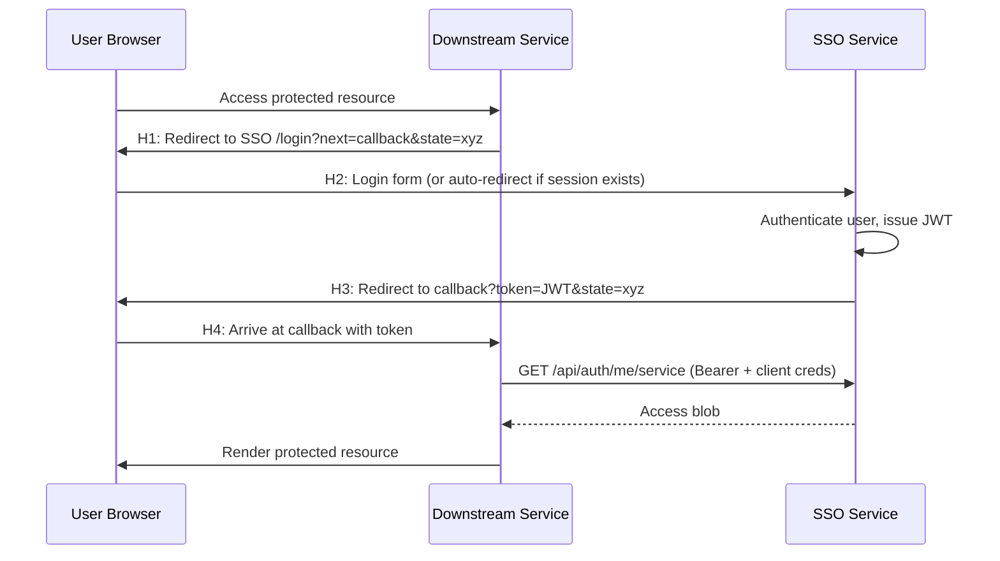
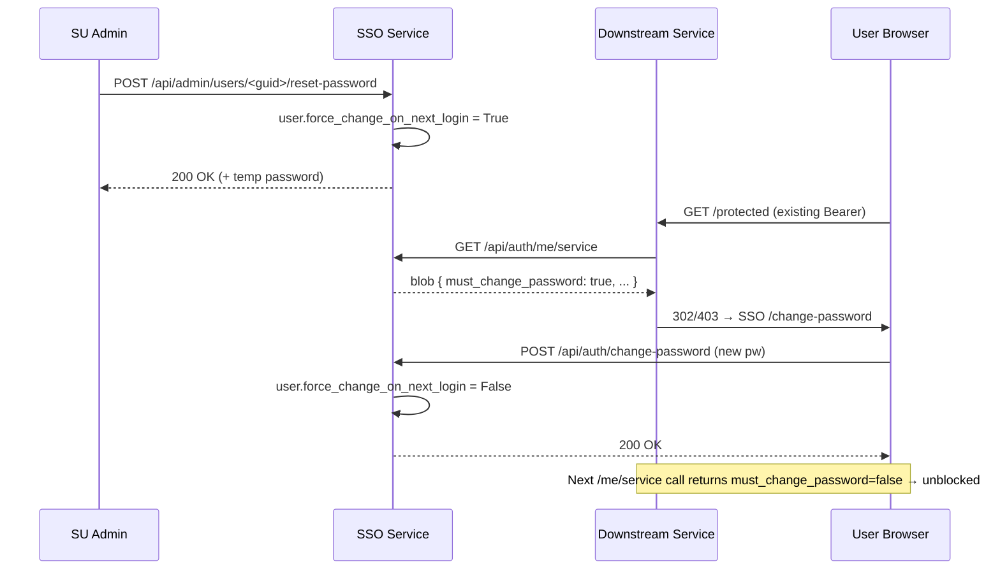
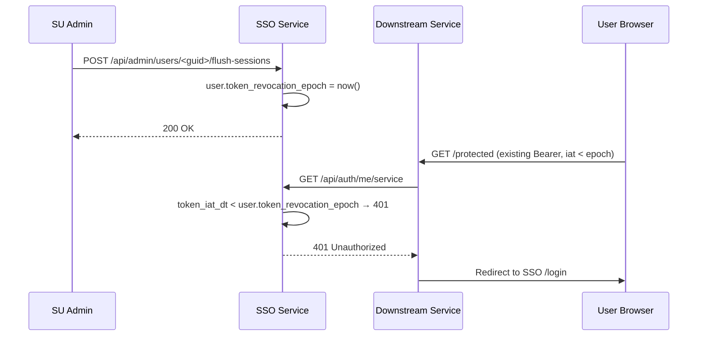
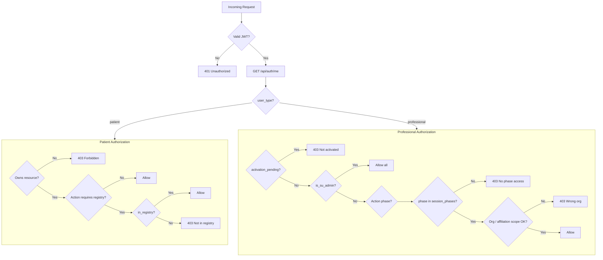

# Architecture Overview

This document describes the **current** SSO service after the access-model
reform (rollup #396: roles registry S2, research-project registry S4,
affiliation binding S3, session-phase intersection S5, blob assembly S6,
guided sign-on / activation gate S9, legacy-field kill-switch M0 #409).

## System Context



## Data Model

All tables use integer primary keys internally and UUID4 GUIDs for external
references (Rule 18). The live schema has **17 tables**. The access-model
reform added `roles`, `research_projects`, `affiliations`, and
`organisation_audit`; the pre-reform tables all remain (the reform dual-runs
`user_organisations` alongside `affiliations` until the M0 #409 cleanup).

| # | Table | Model | Purpose |
|---|-------|-------|---------|
| 1 | `users` | User | Login identity (patient or professional), SU flag, activation `status`, forced-reset + session-flush controls |
| 2 | `patients` | Patient | Patient profile, personnummer, org, registry status |
| 3 | `professionals` | Professional | Professional profile, name, legacy `professional_role` |
| 4 | `organisations` | Organisation | Internal orgs **and** external partners (single table, `is_external`); PDL caregiver hierarchy |
| 5 | `organisation_audit` | OrganisationAudit | Append-only org / partner lifecycle audit |
| 6 | `user_organisations` | UserOrganisation | Legacy person↔org M2M (backfilled into affiliations, kept until #409) |
| 7 | `groups` | Group | Organisational grouping; `category` is a free-form label only |
| 8 | `memberships` | Membership | person↔group membership with status + admin flag |
| 9 | `group_proposals` | GroupProposal | Professional-suggested new groups awaiting SU decision |
| 10 | `leader_requests` | LeaderRequest | Requests for group-admin role awaiting SU decision |
| 11 | `access_requests` | AccessRequest | New-professional onboarding requests |
| 12 | `invites` | Invite | Group invite tokens |
| 13 | `revoked_tokens` | RevokedToken | Per-`jti` token revocation (logout) |
| 14 | `user_phases` | UserPhase | Direct SU phase grants (source of `effective_phases`) |
| 15 | `roles` | Role | **Reform S2** — role registry (7 seed roles, each with a zone + permitted phases) |
| 16 | `research_projects` | ResearchProject | **Reform S4** — research-project (ResDB) registry |
| 17 | `affiliations` | Affiliation | **Reform S3** — person↔CareUnit↔Role binding; the heart of the reform |

```mermaid
erDiagram
    User ||--o| Patient : "has"
    User ||--o| Professional : "has"
    User ||--o{ UserPhase : "direct phase grants"
    User }o--o{ Organisation : "UserOrganisation (legacy)"
    User ||--o{ Affiliation : "person_guid"
    Organisation ||--o{ Affiliation : "care_unit_guid"
    Role ||--o{ Affiliation : "role_guid"
    Organisation ||--o{ Organisation : "parent_caregiver_guid"
    Organisation ||--o{ OrganisationAudit : "has"
    User }o--o{ Group : "Membership"
    Group ||--o{ Membership : "has"
    Group ||--o{ Invite : "has"
    User ||--o{ GroupProposal : "requests"
    User ||--o{ LeaderRequest : "requests"
    AccessRequest ||--o| User : "creates on approve"

    User {
        int id PK
        uuid guid UK
        string email UK
        string password_hash
        enum user_type "patient|professional"
        bool is_su_admin
        enum status "active|pending|suspended (#411 activation gate)"
        bool force_change_on_next_login "#43"
        datetime token_revocation_epoch "#44 nullable"
        datetime created_at
    }

    Affiliation {
        int id PK
        uuid guid UK
        uuid person_guid FK "= User.guid"
        uuid care_unit_guid FK "Organisation that is a CareUnit"
        uuid role_guid FK "Role"
        json research_project_guids "researcher only"
        bool is_admin
        enum status "active|suspended"
    }

    Role {
        int id PK
        uuid guid UK
        string code UK "doctor|nurse|other_care|researcher|..."
        string display_name
        enum zone "care|analysis"
        json permitted_phases "subset of phase names"
    }

    ResearchProject {
        int id PK
        uuid guid UK
        string name UK
        string description
        string ethics_ref "Etikprovningsmyndigheten dnr"
    }

    Organisation {
        int id PK
        uuid guid UK
        string name UK
        bool is_external "internal org vs external partner (#96)"
        uuid parent_caregiver_guid FK "NULL=caregiver, set=care unit (#187)"
        enum auth_kind "oauth_client|api_key|none (external)"
        string client_id "external"
        json allowed_scopes "external"
        json allowed_services "external"
        json allowed_org_guids "external"
        enum status "active|suspended|revoked (external)"
    }

    OrganisationAudit {
        int id PK
        uuid organisation_guid FK
        uuid actor_user_guid FK
        enum event "created|edited|rotated|suspended|reactivated|revoked"
        datetime at
        json before_json
        json after_json
    }

    UserPhase {
        int id PK
        uuid guid UK
        uuid user_guid FK "#46 direct phase grant"
        enum phase "planning|request|provider|analysis"
        uuid granted_by_guid
        datetime granted_at
    }

    Patient {
        int id PK
        uuid guid UK
        int user_id FK
        string personnummer "12 digits"
        uuid organisation_guid FK
        bool in_registry
        json registries
    }

    Professional {
        int id PK
        uuid guid UK
        int user_id FK
        enum professional_role "doctor|nurse|other (LEGACY; superseded by roles+affiliations)"
        string first_name
        string last_name
    }

    UserOrganisation {
        int id PK
        uuid user_guid FK
        uuid organisation_guid FK
    }

    Group {
        int id PK
        uuid guid UK
        string name
        string category "free-form label (#60) — does NOT confer phase access"
        datetime created_at
    }

    Membership {
        int id PK
        uuid guid UK
        uuid user_guid FK
        uuid group_guid FK
        enum status "pending|approved|rejected"
        bool is_admin
        uuid decided_by_guid
    }

    GroupProposal {
        int id PK
        uuid guid UK
        string proposed_name
        string category
        uuid requested_by_guid FK
        enum status "pending|approved|rejected"
    }

    LeaderRequest {
        int id PK
        uuid guid UK
        uuid user_guid FK
        uuid group_guid FK
        enum status "pending|approved|rejected"
    }

    AccessRequest {
        int id PK
        uuid guid UK
        string email
        enum professional_role
        uuid organisation_guid FK
        json requested_phases
        uuid chosen_leader_guid FK
        enum status "pending|endorsed|approved|rejected"
    }

    Invite {
        int id PK
        uuid guid UK
        uuid group_guid FK
        string token UK
        datetime expires_at
    }

    RevokedToken {
        int id PK
        string token_guid UK
        datetime expires_at
    }
```



### The reform triangle: Affiliation ⇄ Role ⇄ Organisation

- An **Affiliation** binds one **person** (`person_guid` = SSO user guid) to
  **one CareUnit** (`care_unit_guid` → an `organisations` row) in **one Role**
  (`role_guid` → a `roles` row). A person can hold several affiliations —
  e.g. Doctor at clinic A and Researcher at clinic B. Uniqueness is enforced
  per `(person, unit, role)`.
- The `roles` registry replaces the old 3-value `Professional.professional_role`
  enum. Seven seed roles ship, each carrying a **zone** (`care` | `analysis`)
  and a **`permitted_phases`** list:

  | code | display | zone | permitted_phases |
  |------|---------|------|------------------|
  | `doctor` | Doctor | care | request, provider, analysis |
  | `nurse` | Nurse | care | request, provider, analysis |
  | `other_care` | Other care professional | care | request, provider |
  | `researcher` | Researcher | analysis | analysis |
  | `quality_registry_reporter` | Quality registry reporter | analysis | analysis |
  | `local_quality_assured` | Local quality-assured | analysis | analysis |
  | `other_analysis` | Other analysis phase | analysis | analysis |

  The role list is SU-edit-only (S8 #410). The `planning` (Plan) phase is
  **orthogonal** — it touches no patient data, is on no role's
  `permitted_phases`, and passes the session intersection whenever granted.
- **ResearchProject** (ResDB) rows are referenced from an affiliation's
  `research_project_guids` (which projects a researcher works on). The
  analysis read is later intersected with the patient's consented projects in
  ips (D1).

### PDL caregiver hierarchy

`organisations` is self-referential via `parent_caregiver_guid`:

- `NULL` → this row **is a caregiver** (vårdgivare / legal data holder) — a
  **CareOrganisation**.
- non-`NULL` → this row is a **vårdenhet / clinic** (a **CareUnit**) whose
  parent caregiver is the pointed-at guid.

`Organisation.care_organisation_guid` resolves a CareUnit up to its caregiver
(or returns its own guid when it is already a caregiver). This is what powers
the caregiver roll-up in the access blob (#188, PDL Ch 4 §§2,4).

### FHIR Resource Mapping

| Table | FHIR Resource Type |
|-------|-------------------|
| Patient | Patient |
| Professional | Practitioner |
| Organisation | Organization |
| Group | Group |

External partners deliberately share the `Organisation` table so that
`Contract.signer.party.reference = Organization/<guid>` works uniformly across
internal payers and external providers (#96).

## Authentication Flow

### Standard Login



### SSO Handshake (H1–H4)

Used by downstream services to authenticate users through the central SSO.



**Security controls:**

- `next` URL validated against the `ALLOWED_CALLBACK_URLS` allowlist.
- `state` parameter passed through for CSRF protection.
- Auto-redirect skips the login form if the user already has a valid session.
- Service-to-service calls to `/api/auth/me/service` require
  `X-SSO-Client-Id` and `X-SSO-Client-Secret` headers. These are matched
  against `SERVICE_CREDENTIALS`, a `{client_id: secret}` map assembled at
  startup from `SSO_CLIENT_ID_<NAME>` / `SSO_CLIENT_SECRET_<NAME>` env pairs
  (`config.py`). A missing or mismatched pair returns **403**.

### Forced Password Reset (#43)



### Bulk Session Flush (#44)



Cheaper than inserting N revoked-token rows when the set of active `jti`s is
unknown (e.g. after a credential compromise across multiple devices).

## Access Blob Schema

The access blob is the core data structure returned by `/api/auth/me` and
`/api/auth/me/service` (`build_access_blob` in `services/auth_service.py`).
Downstream services use it to make authorization decisions.

### Common identity fields (all users)

| Field | Meaning |
|-------|---------|
| `user_guid` | Stable person identity |
| `email` | Login email |
| `user_type` | `patient` \| `professional` |
| `is_su_admin` | Super-user flag (bypasses phase/org gates) |
| `must_change_password` | Forced-reset pending (#43) |
| `session_id` | The `sid` claim from the JWT carrying the request (#191). Stable across every `/me` / `/me/service` call for the same token. Consumers forward it as `X-Operator-Session-Id` so downstream audit logs can correlate all reads under one operator session (Lag 2022:913 chain-of-custody). `null` for pre-#191 tokens. |

### Patient Access Blob

```json
{
  "user_guid": "a1b2c3d4-...",
  "email": "patient@example.com",
  "user_type": "patient",
  "is_su_admin": false,
  "must_change_password": false,
  "session_id": "sess-...",
  "patient_guid": "e5f6g7h8-...",
  "organisation_guid": "i9j0k1l2-...",
  "in_registry": true,
  "registries": ["INCA"],
  "fhir_resource_type": "Patient"
}
```

### Professional Access Blob (current / reform)

```json
{
  "user_guid": "m3n4o5p6-...",
  "email": "doctor@hospital.se",
  "user_type": "professional",
  "is_su_admin": false,
  "must_change_password": false,
  "session_id": "sess-...",
  "professional_guid": "q7r8s9t0-...",
  "fhir_resource_type": "Practitioner",

  "activation_pending": false,
  "affiliations": [
    {
      "affiliation_guid": "aff-...",
      "care_unit_guid": "unit-...",
      "care_unit_name": "Oncology Clinic",
      "care_organisation_guid": "caregiver-...",
      "care_organisation_name": "Region Example",
      "role": "doctor",
      "role_guid": "role-...",
      "is_admin": false,
      "research_project_guids": []
    }
  ],
  "active_affiliation_guid": "aff-...",
  "session_phases": ["analysis", "request"],

  "professional_role": "doctor",
  "organization_ids": ["unit-..."],
  "organisation_warning": false,
  "organization_caregivers": { "unit-...": "caregiver-..." },
  "groups": [
    {
      "group_guid": "u1v2w3x4-...",
      "group_name": "Oncology Planning",
      "category": "planning",
      "status": "approved",
      "is_admin": false
    }
  ],
  "effective_phases": ["analysis", "planning", "request"]
}
```

#### The fields that matter now

- **`affiliations[]`** — the person↔CareUnit↔Role bindings (only `status =
  active` are listed). Each entry resolves the CareUnit up to its
  CareOrganisation and names the role.
- **`active_affiliation_guid`** — the affiliation the current session is
  acting under. Defaults to the sole affiliation when the person has exactly
  one; otherwise `null` (the session selects one via the S9 acting-as flow).
- **`session_phases`** — **this is the field services must gate on now.** It
  is the runtime intersection

  ```
  session_phases = granted_phases ∩ ( active_role.permitted_phases ∪ {planning} )
  ```

  computed by `resolve_session_phases` (S5, Option C). `granted_phases` are the
  raw `UserPhase` grants; the active role narrows them. When there is no active
  role, only orthogonal (`planning`) phases pass.
- **`activation_pending`** — `false` for an activated professional. See the
  activation gate below.

#### Activation gate (S9 #411)

An **unactivated** professional (`User.status != "active"`) receives a
**NO-ACCESS blob** regardless of any granted phases: identity fields are
present, but every scope/phase field is empty and `activation_pending: true`:

```json
{
  "activation_pending": true,
  "affiliations": [],
  "active_affiliation_guid": null,
  "session_phases": [],
  "organization_ids": [],
  "organisation_warning": true,
  "organization_caregivers": {},
  "groups": [],
  "effective_phases": []
}
```

Granting phases is **not** enough — an SU must explicitly **ACTIVATE** the
account (`POST /api/admin/users/<guid>/activate`), which is refused with a
`409 + missing[]` list until the profile is complete (≥1 active affiliation, at
least one granted phase the held role can actually use, and every researcher
affiliation carrying ≥1 research project). This replaces the after-the-fact
`organisation_warning` flag with an up-front gate, so every consumer's existing
phase/org check denies an unactivated user with no consumer-side change.

#### Legacy dual-emitted fields (kill-switch, M0 #409)

For backwards compatibility the blob still emits the pre-reform fields
**alongside** the reform ones. These are gated by the
`SSO_EMIT_LEGACY_BLOB_FIELDS` environment switch (default **`true`**). When it
flips to `false`, the following keys **disappear** from professional blobs:

```
organization_ids, organisation_warning, organization_caregivers,
professional_role, groups, effective_phases
```

(`LEGACY_BLOB_FIELDS` in `auth_service.py`.) The switch can be flipped back to
re-emit instantly. Notes:

- `effective_phases` is the **raw** `UserPhase` grant set (not role-narrowed) —
  services must move to `session_phases`, which is the reform equivalent.
- `professional_role` is the single legacy role string; the reform equivalent
  is the per-affiliation `role`.
- `organization_ids` / `organization_caregivers` come from the legacy
  `user_organisations` M2M and the caregiver roll-up (#188); the reform
  equivalent is `affiliations[].care_unit_guid` /
  `affiliations[].care_organisation_guid`.
- `groups` remains available while the switch is on but was always orthogonal
  to access — `Group.category` is a free-form label and confers no phase (#57,
  #60).

### Partner access blob (external callers)

`POST /api/internal/partner/<guid>/validate` (service-key protected) validates
an external partner's credential and returns a distinct blob shape:

```json
{
  "access_blob": {
    "user_type": "partner",
    "partner_guid": "org-...",
    "organisation_guid": "org-...",
    "display_name": "Acme Integrations",
    "allowed_scopes": ["fhir.observation.read"],
    "allowed_services": ["cdr.pdhc"],
    "allowed_org_guids": ["..."],
    "is_su_admin": false,
    "organization_ids": ["..."]
  }
}
```

## Decision Tree

Downstream services use the access blob to authorize actions. Post-reform, the
professional phase check is against **`session_phases`**:



## Endpoint Map (blueprints)

| Blueprint | Prefix | Purpose |
|-----------|--------|---------|
| `auth` | `/api/auth` | `login`, `me`, `me/service`, `logout`, `change-password` |
| `patient` | `/api/patient` | Patient self-service |
| `groups` | `/api/groups` | Membership / admin / invite flows |
| `admin` | `/api/admin` | SU administration (see below) |
| `registry` | `/api/registry` | Roles, research-projects, care-organisations, care-units |
| `public` | `/api/public` | Unauthenticated lookups + access-request + partner lookup |
| `internal` | — | Service-key internal endpoints (push-config, partner validate) |
| `partners` | — | External-partner subsystem (`/api/admin/partners/*`, etc.) |
| `frontend` | — | Server-rendered pages + service-key admin |
| `fhir` | — | Capability statement |

### SU admin surface (`/api/admin`)

- **Users:** `GET /users`, `POST /promote-su`, `DELETE /users/<guid>`,
  `POST /users/<guid>/reset-password`, `POST /users/<guid>/flush-sessions`.
- **Phases:** `GET|POST /users/<guid>/phases`,
  `DELETE /users/<guid>/phases/<phase>`.
- **Affiliations (reform):** `GET|POST /users/<guid>/affiliations`,
  `DELETE /users/<guid>/affiliations/<affiliation_guid>`.
- **Activation (S9):** `GET /users/<guid>/completeness` (server-computed
  checklist), `POST /users/<guid>/activate` (409 + `missing[]` when
  incomplete), `POST /users/<guid>/deactivate` (back to `pending`).
- **Org membership:** `GET|POST /users/<guid>/organisations`,
  `DELETE /users/<guid>/organisations/<org_guid>`.
- **Organisations:** `GET|POST /organisations`, `PUT|DELETE
  /organisations/<guid>`, `GET /organisations/<guid>/dependents`,
  `GET /organisations/<guid>/push-config`.
- **Groups / requests:** `DELETE /groups/<guid>`, `POST /assign-group-admin`,
  `GET|POST /group-proposals`, `GET|POST /leader-requests`,
  `GET|POST /access-requests`.
- **Bulk:** `GET /export-users`, `POST /import-users`,
  `GET|PUT /oath-overview`.

### Registry surface (`/api/registry`) — SU-edit, read-open

- `GET /roles` (open to any authenticated professional),
  `POST /roles`, `PUT /roles/<guid>`, `DELETE /roles/<guid>` (SU only; delete
  refuses if any affiliation still references the role).
- `GET /research-projects` (open), `POST|PUT|DELETE /research-projects[/<guid>]`
  (SU only).
- `GET /care-organisations`, `GET /care-units` — dropdown feeds for the guided
  affiliation form.

### External-partner subsystem

External partners are `organisations` rows with `is_external = true`
(`routes/partners.py`). The URL surface keeps "partner" naming because that is
the SU-facing concept:

- **Public:** `GET /api/public/partner/<guid>` — sparse public projection
  (name, country, status, description; no contact info, scopes, or auth
  material).
- **Internal:** `POST /api/internal/partner/<guid>/validate` (service-key) —
  checks status/expiry and verifies the presented secret against the stored
  `client_secret_hash` / `api_key_hash`; returns the partner access blob.
- **Admin (SU Bearer or session):** `GET|POST /api/admin/partners`,
  `GET|PATCH /api/admin/partners/<guid>`, and lifecycle actions
  `POST .../rotate`, `.../suspend`, `.../reactivate`, `.../revoke`, plus
  `GET .../audit` and `GET /api/admin/partners/_meta/catalogue` (the closed
  `SCOPE_CATALOGUE` and `KNOWN_SERVICES` sets). Secrets are shown **once** on
  create/rotate; `country_code`, `org_number`, and `auth_kind` are immutable
  after creation. Every state change writes an `organisation_audit` row.

### Service-key administration

`frontend_bp` exposes `GET /api/admin/service-keys`,
`GET /api/admin/service-keys/<service_name>/users`, and
`POST /api/admin/service-keys/<service_name>/generate` for managing the
`SSO_CLIENT_ID`/`SSO_CLIENT_SECRET` credentials that downstream services present
on `/me/service`.

## Middleware Stack

Each request passes through these layers in order:

1. **CORS** — validates the `Origin` header against `ALLOWED_ORIGINS`.
2. **Rate Limiter** — in-memory per-IP limits (configurable per endpoint).
3. **CSRF** — Flask-WTF token validation on form POST (JSON API routes exempt).
4. **Auth Middleware** — JWT decode, `jti` revocation check,
   `iat < user.token_revocation_epoch` check (#44), and user loading into
   `g.current_user` (with `g.token_payload` carrying the `sid`).
5. **Route Handler** — blueprint endpoint logic.
6. **Audit Logger** — structured log entry for sensitive operations.

Additional hardening: `ProxyFix` (trusts one hop of `X-Forwarded-*`), secure
session cookies (`Secure`/`HttpOnly`/`SameSite=Lax`), security headers
(`X-Frame-Options`, `X-Content-Type-Options`, HSTS, etc.), and a 16 MB upload
cap.

## Port Allocation

| Port | Service |
|------|---------|
| 9000 | Flask application (Gunicorn) |
| 9003 | PostgreSQL database |
</content>
